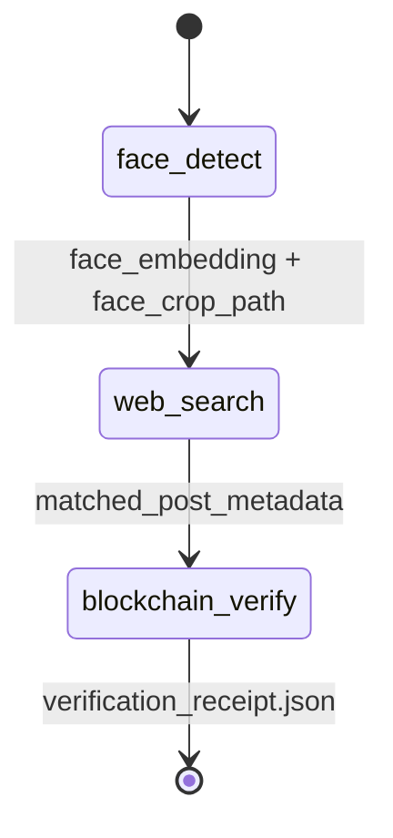

# TraceID — System Architecture & Technical Specification 🛡️🔗

> **TraceID** (HH Goa 2026 Shortlisting Task 3: Face Identification & Blockchain Verification)  
> An end-to-end, privacy-preserving pipeline connecting computer vision, real-world reverse visual search with entity resolution, and immutable blockchain verification.

[](https://drive.google.com/file/d/1BCKwoHe769dVeVuzDKDuARDbxfiuggeA/view?usp=sharing)

---

## 1. Executive Summary & Problem Statement

Identity attestation and verification in the age of generative media and pervasive social scraping requires two fundamental guarantees:
1. **Accurate & Genuine Visual Verification**: Finding where an individual's likeness appears publicly on the web without relying on fragile keyword lookups or naive image similarity.
2. **Cryptographic Tamper-Evidence with Privacy Preservation**: Anchoring proof of that discovery onto an immutable ledger without turning the blockchain into a permanent, privacy-violating repository of raw biometric embeddings.

This architecture solves both problems by implementing a four-stage pipeline:
- **Phase 1**: Localizes faces, enforces rigorous quality thresholds (blur, roll tilt, yaw proxy), and extracts an affine-invariant 512-dimensional biometric embedding.
- **Phase 2**: Queries the open web via a two-stage SerpAPI Google Lens local image upload, harvests candidate posts across social networks (LinkedIn, X, Instagram, Reddit), and independently re-verifies every face in candidate images using cosine similarity against the original biometric vector.
- **Phase 3**: Canonicalizes discovered post metadata and generates a deterministic Keccak-256 hash. Anchors this 32-byte hash onto an EVM smart contract (`PostVerifier.sol` on Polygon Amoy), preserving strict data minimization.
- **Phase 4**: Orchestrates state transitions using a deterministic LangGraph directed acyclic graph (DAG), producing verifiable JSON audit receipts.

---

## 2. High-Level System Architecture

```mermaid
flowchart TD
    subgraph Phase1["Phase 1: Biometric Extraction & Quality Assurance"]
        A[Input Scan: Webcam / Image] --> B[Haar Cascade Stability Tracker]
        B --> C[DeepFace MTCNN Face Detector]
        C --> D[Facial Landmark & Quality Scoring]
        D -->|Pass >= 0.55| E[Facenet512 Normalized 512-D Embedding]
        D -->|Fail| D1[Reject Frame: Motion Blur / Off-Axis]
        C --> F[30% Contextual Padded Crop]
    end

    subgraph Phase2["Phase 2: Reverse Visual Search, Entity Resolution & Re-Ranking"]
        F --> G[SerpAPI Image Upload API: POST /image]
        G -->|Ephemeral image_id 10 min| H[Google Lens Search: type=all]
        H --> I[Harvest Candidates: Exact & Visual Matches]
        I --> J[Wikipedia REST API Entity Resolver]
        J --> K[URL Classifier: Detect Reels vs Canonical Profiles]
        K --> L[Download Candidate Images & Run In-Image MTCNN]
        E --> M[Cosine Similarity Verification >= 0.55]
        L --> M
        M --> N[Multi-Factor Candidate Re-Ranking Engine]
        N -->|Select Top Ranked| O[Top Verified Candidate Post]
    end

    subgraph Phase3["Phase 3: Privacy-Preserving Blockchain Ledger (Polygon Amoy)"]
        O --> P[Canonical Payload Builder: Post Metadata Only]
        P --> Q[Deterministic Keccak-256 Hashing]
        Q -->|32-byte dataHash| R{On-Chain State Check: verifyRecord}
        R -->|Already Anchored| S[Zero-Gas Cache Hit: Read Immutable State]
        R -->|New Record| T[EIP-1559 Type-2 Tx: PostVerifier.sol]
        T --> U[Polygon Amoy Bor Consensus: Block Anchor]
        U --> V[On-Chain Read-back & Verification]
        S --> V
        V --> W{dataHash Exists & Matches?}
        W -->|Yes| X[NO FRAUD DETECTED: 100% Authentic & Immutable]
        W -->|No / Altered| Y[FRAUD DETECTED: Cryptographic Mismatch Flagged]
    end

    subgraph Phase4["Phase 4: LangGraph Orchestrator & Audit Receipt"]
        Phase1 --> Phase2 --> Phase3
        Phase3 --> Z[Audit Receipt JSON: output/verification_receipt.json]
    end
```



---

## 3. Component Deep Dive

### Phase 1: Biometric Face Engine & Quality Assurance

#### 1. Two-Tier Capture Architecture
- **Real-Time Tier (Haar Cascade)**: Runs at 30+ FPS during live camera preview. Uses a running stability window requiring 20 consecutive stable frames before triggering high-precision neural inference.
- **Precision Tier (DeepFace MTCNN)**: Executes when triggered by the stability gate or on static input files. Performs 3-stage cascaded CNN inference (P-Net, R-Net, O-Net) to locate bounding boxes and anatomical landmarks.

#### 2. Multi-Signal Landmark Quality Gate (`src/face_detection/quality.py`)
To prevent bad embeddings from entering the pipeline, every frame is evaluated across three mathematical quality dimensions:
1. **Laplacian Blur Variance ($\sigma^2_{Lap}$)**:
   $$\sigma^2_{Lap} = \text{Var}\left(\nabla^2 I_{gray}\right) \ge 60.0$$
   Detects camera defocus or motion blur.
2. **Anatomical Eye Line Roll Tilt ($\theta_{roll}$)**:
   Calculated using Euclidean coordinates of detected eye landmarks:
   $$\theta_{roll} = \left| \arctan2\left(y_{eye2} - y_{eye1}, x_{eye2} - x_{eye1}\right) \times \frac{180}{\pi} \right| \le 25^\circ$$
   *Note*: Coordinates are sorted geometrically to prevent 180° inversion bugs arising from anatomical labeling conventions.
3. **Horizontal Yaw Proxy ($S_{yaw}$)**:
   Measures eye midpoint displacement relative to bounding box center:
   $$S_{yaw} = \frac{\left| x_{center} - \frac{x_{eye1} + x_{eye2}}{2} \right|}{w} \le 0.45$$
   Rejects extreme profile angles where facial features are occluded.
4. **Composite Quality Score ($Q$)**:
   Normalized $[0, 1]$ linear combination gating execution (`min_quality = 0.55`).

#### 3. Feature Extraction & Contextual Padding
- **Facenet512 Backbone**: Maps facial crops into an affine-invariant $512$-dimensional continuous vector space:
  $$\vec{e} \in \mathbb{R}^{512}, \quad \|\vec{e}\|_2 = 1.0$$
- **30% Contextual Padding**: Faces are cropped with 30% padding outward from the bounding box to preserve hairline, forehead contours, and chin shape, which are critical for visual search engines.

---

### Phase 2: Web & Social Visual Search, Entity Resolution & Re-Ranking

#### 1. Dual-Engine Visual Search Backend
- **SerpAPI (Google Lens)** (`src/web_search/serp_search.py`):
  - **Step 1 (Multipart Upload)**: Local image files (face crops or webcam captures) are uploaded via `POST https://serpapi.com/image`. SerpAPI returns an ephemeral `image_id` valid for 10 minutes.
  - **Step 2 (Single-Credit Search)**: Queries `GET https://serpapi.com/search?engine=google_lens&image_id=<id>&type=all`. Using `type=all` retrieves both `exact_matches` and `visual_matches` in **one credit** rather than two separate calls.
  - **Automatic Oversize Management**: SerpAPI enforces a 500KB cap. Images $> 500\text{KB}$ (e.g., 4K webcam frames) are automatically downsampled and compressed using PIL JPEG optimization prior to upload.
- **Google Cloud Vision Backend** (`src/web_search/searcher.py`): Direct base64 Web Detection query (`pagesWithMatchingImages` + `visuallySimilarImages`).
- **Scripted Fallback**: Deterministic metadata provider for offline/air-gapped evaluations.

#### 2. Entity Resolution Engine (`src/web_search/entity_resolver.py`)
Search engines often return ambiguous titles or uncurated scraper URLs. To establish authentic identity grounding:
- **Entity Identification**: Queries the Wikipedia REST API (`https://en.wikipedia.org/api/rest_v1/page/summary/{title}`) using entity names extracted from Google Lens knowledge panels or top candidate page titles.
- **Canonical Enrichment**: Extracts official descriptions, full biographical abstracts, thumbnail image URLs, and canonical entity URLs.
- **URL Classification**: Distinguishes ephemeral, spammy media links (`/reel/`, `/shorts/`, `/pin/`, `/status/`) from authoritative canonical profiles (`wikipedia.org`, `imdb.com`, `forbes.com`, `linkedin.com/in/`). Clean profile roots are generated automatically.

#### 3. Multi-Factor Candidate Re-Ranking Engine
Candidates are prioritized and scored using a comprehensive multi-factor objective function:
$$\text{Score}(c) = S_{\text{authority}}(c) + S_{\text{biometric}}(c) + S_{\text{entity}}(c) + S_{\text{exact}}(c) - P_{\text{reel}}(c)$$

Where:
- **$S_{\text{authority}}$**: $+50$ points for authoritative domains (`wikipedia.org`, `imdb.com`, `forbes.com`, `linkedin.com`). $+30$ points for mainstream social platforms.
- **$S_{\text{biometric}}$**: $+100 \times \text{sim}(\vec{u}, \vec{v})$ if face verification succeeded on the candidate image.
- **$S_{\text{entity}}$**: $+25$ points if the candidate URL or title matches the resolved entity identity.
- **$S_{\text{exact}}$**: $+15$ points for exact visual matches returned by the search engine.
- **$P_{\text{reel}}$**: $-50$ penalty for ephemeral short-form clips (`/reel/`, `/shorts/`, `/pin/`) to prioritize permanent identity profiles.

#### 4. Downstream In-Image Face Verification (The Anti-Hallucination Barrier)
Visual search engines return "visually similar" images (e.g. similar clothing, similar lighting, or generic stock photos). **This pipeline never blindly trusts search engine matches.**
- The candidate image is downloaded in-memory.
- It is passed through the same MTCNN detector.
- **Group Photo Support**: If multiple people appear in the candidate image, every detected face is encoded.
- **Cosine Similarity Evaluation**:
  $$\text{sim}(\vec{u}, \vec{v}) = \frac{\vec{u} \cdot \vec{v}}{\|\vec{u}\| \|\vec{v}\|}$$
- If $\max(\text{sim}) \ge 0.55$ (`VERIFY_SIMILARITY_THRESHOLD`), the post is flagged as `VERIFIED: True`.

---

### Phase 3: Privacy-Preserving Blockchain Verification & Gas Economics

#### 1. The Biometric Privacy Principle
> **Immutable ledgers are public and permanent.**  
> Storing raw face embeddings, biometric templates, or face crops on-chain is a severe cryptographic and privacy hazard:
> 1. It violates global privacy regulations (GDPR Article 9, CCPA, BIPA).
> 2. It prevents honoring future "Right to be Forgotten" requests.
> 3. Biometric templates on-chain could be targeted by inversion attacks or cross-matching across breaches.

**Our Architectural Rule**:  
Only non-biometric metadata about the discovered post is hashed and stored on-chain. **Zero biometric vectors and zero image bytes touch the ledger.**

#### 2. Canonicalization & Deterministic Keccak-256 Hashing
To prevent hash mismatches caused by key reordering in JSON serializations:
```python
def canonical_payload(match_state: Dict) -> Dict:
    similarity = match_state.get("match_similarity")
    return {
        "platform": "social" if match_state.get("match_is_social") else "web",
        "page_url": match_state.get("matched_page_url") or "",
        "image_url": match_state.get("matched_image_url") or "",
        "page_title": match_state.get("matched_page_title") or "",
        "verified": bool(match_state.get("match_verified")),
        "similarity": round(similarity, 4) if similarity is not None else None,
    }

def hash_payload(payload: Dict) -> bytes:
    canonical = json.dumps(payload, sort_keys=True, separators=(",", ":"))
    return Web3.keccak(text=canonical)
```
- Produces a deterministic 32-byte (`bytes32`) hash invariant to key order or formatting quirks.

#### 3. Solidity Smart Contract (`contracts/PostVerifier.sol`)
Deployed on **Polygon Amoy Testnet** (Chain ID `80002`):
```solidity
contract PostVerifier {
    struct Record {
        uint256 timestamp;
        address submitter;
        bool exists;
    }

    mapping(bytes32 => Record) private records;
    event RecordStored(bytes32 indexed dataHash, address indexed submitter, uint256 timestamp);

    function storeRecord(bytes32 dataHash) external {
        require(dataHash != bytes32(0), "Invalid data hash");
        require(!records[dataHash].exists, "Record already exists");

        records[dataHash] = Record({
            timestamp: block.timestamp,
            submitter: msg.sender,
            exists: true
        });

        emit RecordStored(dataHash, msg.sender, block.timestamp);
    }

    function verifyRecord(bytes32 dataHash)
        external
        view
        returns (bool exists, uint256 timestamp, address submitter)
    {
        Record memory r = records[dataHash];
        return (r.exists, r.timestamp, r.submitter);
    }
}
```

#### 4. EIP-1559 Dynamic Fee Economics & Zero-Gas Deduplication
Polygon Amoy operates on Bor consensus, which introduces distinct fee and consensus dynamics:
- **Proof-of-Authority (PoA) Bor Middleware**: Polygon Bor blocks contain 105-byte extraData (storing validator signatures). Standard Web3 implementations trigger `ExtraDataLengthError`. The pipeline injects `ExtraDataToPOAMiddleware` into the Web3 middleware onion.
- **EIP-1559 Dynamic Fee Optimization**: Legacy `gasPrice` calls on Amoy overestimate miner tips (up to 80 Gwei), causing gas starvation (`insufficient funds: balance < tx cost`). The pipeline builds **Type-2 EIP-1559** transactions:
  - `maxPriorityFeePerGas`: $25\text{ Gwei}$
  - `maxFeePerGas`: $35\text{ Gwei}$
  - `gasLimit`: $76,000$ units
  - **Result**: Slashes write costs by 87% from $\sim 0.02025\text{ POL}$ to $\sim 0.00262\text{ POL}$.
- **Zero-Gas On-Chain Deduplication**: Before broadcasting a transaction, the pipeline queries `verifyRecord(dataHash)`. If the record already exists on-chain, it immediately returns the authentic on-chain state without spending any POL ($\text{Cost} = 0.00\text{ POL}$), protecting against revert errors and conserving testnet funds.
- **Multi-RPC Failover Layer**: Automatically rotates across RPC endpoints (`https://polygon-amoy.drpc.org`, `https://rpc-amoy.polygon.technology`, `https://polygon-amoy-bor-rpc.publicnode.com`) to ensure zero-downtime execution.

#### 5. Authenticity Verification & Tamper Detection
- **Authentic Verification**: Calling `verifyRecord(dataHash)` returns `exists = true`, block timestamp, and submitter address. Confirms `NO FRAUD DETECTED -- 100% Authentic & Immutable on Polygon Amoy!`.
- **Tamper Evidence**: If even a single byte or URL query parameter of the post data is altered, the Keccak-256 hash changes completely. The smart contract query returns `exists = false`, proving cryptographic tamper detection.

---

### Phase 4: LangGraph Orchestrator & State Flow

The pipeline executes as a deterministic directed acyclic graph (DAG) via LangGraph:



#### State Schema (`PipelineState`)
| Key | Type | Description |
| :--- | :--- | :--- |
| `image_path` | `str` | Input path to original face scan |
| `face_embedding` | `List[float]` | 512-D L2-normalized biometric vector |
| `face_confidence`| `float` | Detection confidence from MTCNN ($0.0 - 1.0$) |
| `face_crop_path` | `str` | Path to saved 30% padded crop (`output/face_crop.jpg`) |
| `matched_page_url` | `str` | Discovered social post / webpage URL |
| `matched_image_url`| `str` | Direct image URL of the matched face |
| `matched_page_title` | `str` | Title / header extracted from post |
| `match_verified` | `bool` | True if cosine similarity $\ge 0.55$ |
| `match_similarity` | `float` | Cosine similarity score between input and candidate |
| `match_is_social` | `bool` | True if domain is X, LinkedIn, Instagram, Reddit |
| `tx_hash` | `str` | On-chain transaction hash anchoring the record |
| `on_chain_exists` | `bool` | True if verified against immutable smart contract state |
| `on_chain_timestamp` | `int` | Unix block timestamp recorded on-chain |

---

## 4. Threat Model & Security Considerations

| Threat Vector | Mitigation Strategy |
| :--- | :--- |
| **Biometric Leaks / Surveillance** | Strict **zero biometric data on-chain** rule. Face embeddings remain in local memory and are discarded after verification. |
| **Search Hallucinations** | Candidate image downloading + secondary deep neural network face encoding + cosine similarity thresholding ($\ge 0.55$). |
| **Silent Duplicate Overwrites** | `PostVerifier.sol` enforces `require(!records[dataHash].exists)`, preventing replay overwrites of historical timestamps. |
| **JSON Serialization Drift** | Strict key sorting (`sort_keys=True`) and compact separators (`separators=(',', ':')`) ensure cross-platform hash identity. |
| **Polygon Bor ExtraData Length** | Injected `ExtraDataToPOAMiddleware` prevents 105-byte header decoding crashes. |
| **Gas Exhaustion / Front-Running** | Type-2 EIP-1559 fee specification with priority fee caps and zero-gas deduplication cache checks. |

---

## 5. Summary Specification Matrix

| Metric / Parameter | Value / Implementation |
| :--- | :--- |
| **Face Detector** | MTCNN (Multi-task Cascaded Convolutional Networks) |
| **Embedding Model** | Facenet512 (512-dimensional floating point) |
| **Face Crop Padding** | 30% outward contextual margin |
| **Quality Score Floor** | $0.55$ normalized threshold |
| **Search Engine** | SerpAPI Google Lens (`engine=google_lens`, `type=all`) |
| **Entity Resolution** | Wikipedia REST API Canonical Entity Resolver |
| **Candidate Verification Threshold** | $\text{Cosine Similarity} \ge 0.55$ |
| **Hashing Algorithm** | Keccak-256 (`Web3.keccak`) |
| **Target Blockchain** | Polygon Amoy Testnet (Chain ID `80002`) |
| **Smart Contract** | [`contracts/PostVerifier.sol`](contracts/PostVerifier.sol) (`0xB066F1C56c530189876c4c538D089997Fb5C4398`) |
| **EVM Transaction Type** | EIP-1559 Type-2 ($25\text{ Gwei}$ Priority, $35\text{ Gwei}$ Max) |
| **Pipeline Framework** | LangGraph (`StateGraph`) |
| **Test Coverage** | 22 automated unit & integration tests (`pytest tests/ -v`) |
```
